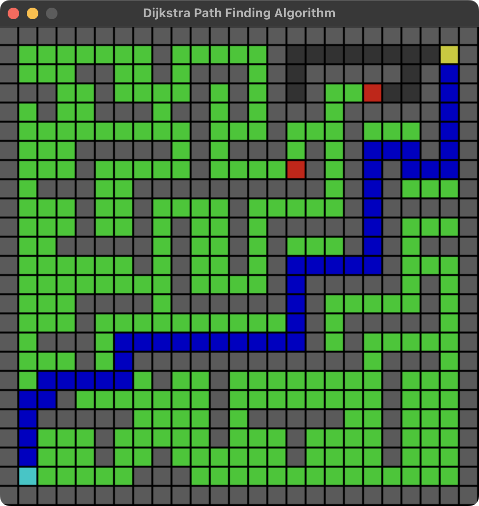
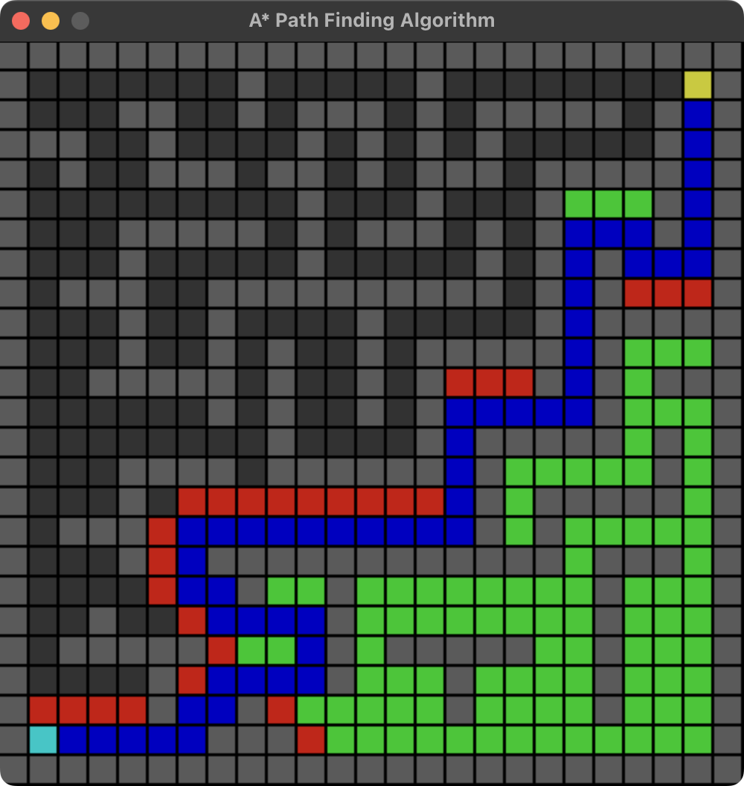

# UTS_DAA3

| Tombol       | Deskripsi    |
| -----------  | -----------  |
| Klik kanan   | Atur start box (pertama) dan target box (kedua) |
| Klik kiri    | Atur wall |
| Spasi        | Mulai algoritma |

Perbandingan algoritma dilakukan dengan menggunakan flag `--maze`
```
python dijkstra.py --maze
```
dan
```
python a-star.py --maze
```

## Dijkstra


## A*


## Legenda
+ <span style="color:rgb(0, 200, 200)">Start Box</span>
+ <span style="color:rgb(200, 200, 0)">Target Box</span>
+ <span style="color:rgb(0, 200, 0)">Visited Box</span>
+ <span style="color:rgb(200, 0, 0)">Queued Box</span>
+ <span style="color:rgb(0, 0, 200)">Path</span>
+ <span style="color:rgb(90, 90, 90)">Wall</span>
+ <span style="color:rgb(50, 50, 50)">Untracked Box</span>